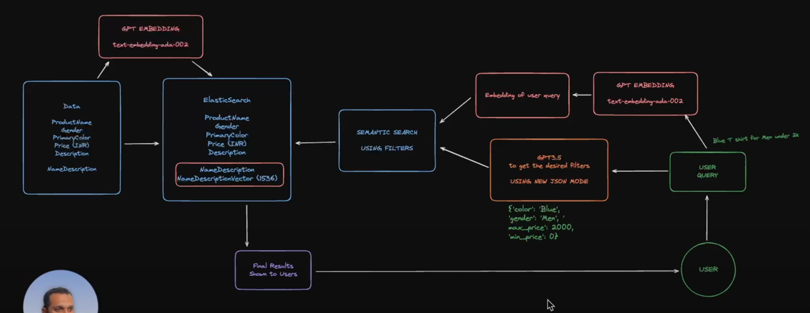

## Semantic Search

### ElasticSearch semantic search implementation

1. SBERT model (reference: https://www.youtube.com/watch?v=KSwPR9eig7w)
2. GPT model

### Env setup

```bash
python3 -m venv venv
source venv/bin/activate
```

### Steps to run the search app

- SBERT search

```
docker-compose up -d
# after setting up the env
# index the data by running the ipynb file
pip install requirements.txt
streamlit run search_app.py
```

- Advanced Semantic Search with GPT model 

